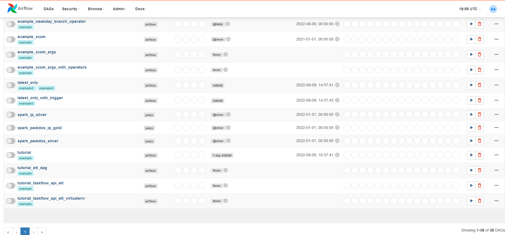
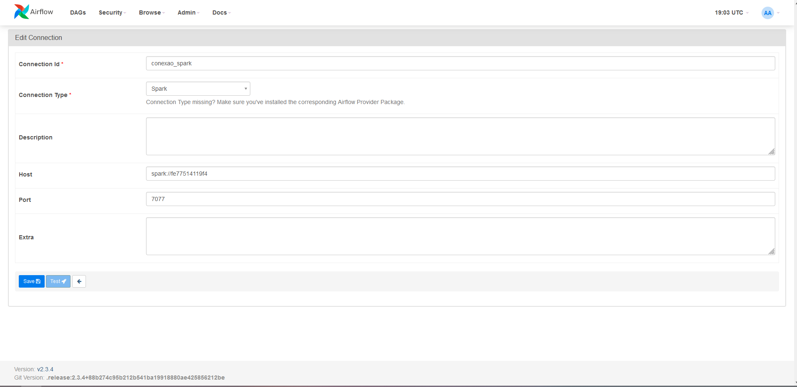

# appmax_desafio
Resolução do case para data engineer jr


# Passo a passo

Para iniciar você deve clonar esse repositório em sua máquina.


```
git clone link
```
A estrutura de pastas já está toda pronta, então basta construir a imagem do dockerfile, para fazer isso utilize o seguinte comando:

```
docker build .
```

Antes de inicializar tudo temos que fazer o seguinte comando, para criar as credências do airflow, segundo a documentação oficial.
```
docker-compose -f docker-compose.airflow.yaml up airflow-init
```

Agora podemos inicializar tudo
```
docker-compose -f docker-compose.spark.yaml -f docker-compose.airflow.yaml up
```

## Airflow

Para acessar o Airflow basta ir até **localhost:8080** no seu navegador. Irá abrir uma tela de login do airflow.


```
Usuário: airflow
Senha: airflow
```
## Spark

Para acessar o Spark basta ir até **localhost:9090** no seu navegador. Neste endereço pegamos o endereço do spark para fazer a conexão com o airflow.

No meu caso foi spark://ec0cc1435450:7077 

## Jupyter Notebook

Para acessar o jupyter notebook basta ir até **localhost:8888** no seu navegador, irá abrir uma tela pedindo a senha, basta colocar a palavra tad.


## Execução

Para executar as dags, basta entrar no airflow e procurar por spark_ip_silver, spark_pedidos_silver e spark_pedidos_ip_gold e dar play, pois era foram programadas para executar apenas uma vez e estão desativadas por padrão.



# Explicações e decisões

O arquivo docker-compose.airflow foi extraido do [site oficial](https://airflow.apache.org/docs/apache-airflow/stable/docker-compose.yaml), mas com algumas modificações para podermos ter acesso ao spark. Porque por padrão o airflow não tem acesso ao spark.

Para configurar a conexão devemos fazer o login no airflow, clicar em admin e depois conections e configurar nossa conexão. Configurei a minha com os parametros:

* Connection Id = conexao_spark (Esse nome será utilizado nas dags)
* Connection Type = Spark (O Spark não estará disponível se você não fizer o docker build)
* Host = spark://ec0cc1435450 (Podemos pegar esse caminho ao acessar o spark)
* Port = 7077 (Números após os dois pontos no caminho do spark)



Separei em 3 dags, onde cada dag utiliza o spark submit operator, que evoca um job do spark:

* dag_gold - chama o job do spark atividade_3.py
* dag_ip - chama o job do spark atividade_2.py 
* dag_pedidos - chama o job do spark atividade_1.py

Explicando os jobs do spark:

* atividade_1.py - Realiza a leitura do arquivo /dags/spark_jobs/bronze/pedidos.csv e realiza as trativas solicitas e salvar como o arquivo /dags/spark_jobs/silver/pedidos.parquet
* atividade_2.py - Realiza a leitura do /dags/spark_jobs/bronze/ips.csv e com esse ip's faz a requisição na api, os dados da api são gravados no arquivo /dags/spark_jobs/bronze/ips_api.csv, após isso esses dois arquivos são lidos e agrupados no arquivo /dags/spark_jobs/silver/api.parquet
* atividade_3.py - leitura dos arquivos /dags/spark_jobs/silver/api.parquet e /dags/spark_jobs/silver/pedidos.parquet agrupando eles e salvando /dags/spark_jobs/gold/pedidos_com_ip.parquet

# Problemas e pontos a melhorar

## Problemas

Meu computador ficava muito lento enquanto todos os contaneirs estavam sendo executado, dessa forma não consegui executar todos os passos muito bem, apenas por partes. Por conta disso não consegui executar todas as dags diretamente, então executei os jobs do spark no jupyter notebook. As únicas dags que consegui executar foi dag_gold e dag_pedidos, acho que por conta das requisições da API, a dag_ip dava erro de memória no meu computador.

## Pontos a melhorar

O job atividade_2.py poderia ter sido dividido em dois jobs, um para fazer as requisições e criar o arquivo e outro job só para fazer o agrupamento e salvar na silver.

Os dados ficaram dentro de uma pasta com os códigos, isso foi devido a problemas de leitura quando colocava eles em pastas distintas, então por conta disso ficaram todos dentro da pasta dag, mas deviam estar mais isolados.


# Referências

* https://towardsdatascience.com/setting-up-apache-airflow-with-docker-compose-in-5-minutes-56a1110f4122
* https://airflow.apache.org/docs/apache-airflow/stable/start/docker.html
* https://airflow.apache.org/docs/apache-airflow/stable/start/docker.html#customizing-the-quick-start-docker-compose
* https://stackoverflow.com/questions/67554074/airflow-trigger-spark-in-different-docker-container
* https://github.com/yTek01/docker-spark-airflow
* https://medium.com/codex/executing-spark-jobs-with-apache-airflow-3596717bbbe3